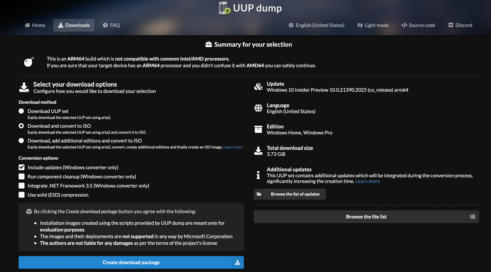
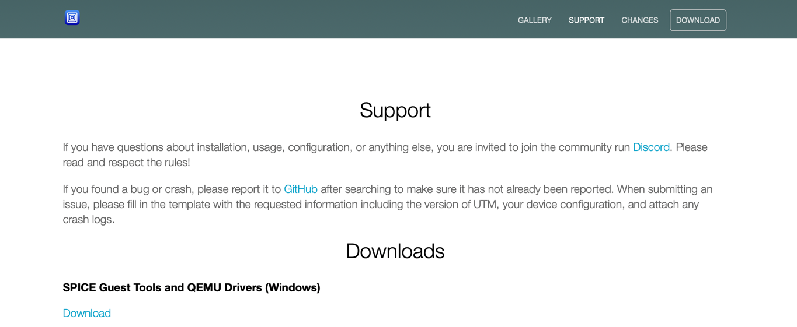

# Passo a passo para a instalação do windows 10 pro ARM no mac via VM utilizando o Software UTM.

## Instalação do software:
1. Acessar o site : <https://mac.getutm.app>


2. Clicar em download


3. Arrastar o ícone "UTM" para sua pasta de aplicações.
4. Pronto. Software instalado!  

### Baixar o script para gerar a imagem ISO do windows 10 que será instalada.

1. Acessar o site: <https://uupdump.net/download.php?id=7811e991-621e-4b0c-a066-ee0d4b53eacf&pack=en-us&edition=core;professional>



2. Clicar no botão azul "Create download Package".
3. Prontinho. No seu folder "/Downloads" estará uma nova pasta com o nome "/21390". Deixe-a aí como está.

## Instalação Software Homebrew.
1. Acessar o site: <https://brew.sh/index_pt-br>


2. Abra o terminal. O comando no teclado para facilitar a busca é "command + barra de espaço" -> Digite "terminal" e aperte enter.
3. Copiar o comando de instalação e copiar no terminal. Aperte enter. Para facilitar, irei coloca-lo abaixo:

```
/bin/bash -c "$(curl -fsSL https://raw.githubusercontent.com/Homebrew/install/HEAD/install.sh)"
```

4. ATENÇÃO!! Ao fim da instalação, você será orientado a realizar outro ou outros(1 ou 2) comandos. É necessário copiar e colar esses comandos no prompt de comando para que sejam executados.

## Rodar o script que está localizado na pasta 21390 que você baixou anteriormente.

1. Utilizando o terminal, vá para a pasta do arquivo que você baixou anteriormente. Aquela pasta chamada 21390. Para isso, pode utilizar o comando abaixo no terminal, caso facilite.

```
cd Downloads/21390 
```


2. Agora você terá que copiar, colar e executar os quatro comandos a seguir no terminal.
```
brew tap sidneys/homebrew
```

```
brew install aria2 cabextract wimlib cdrtools sidneys/homebrew/chntpw
```

```
chmod +x uup_download_macos.sh
```

```
sh uup_download_macos.sh
```

3. Prontinho. Isso irá gerar a imagem .ISO que você utilizará para instalar o windows 10 na VM.

4. Por último, você precisará baixar o arquivo que contem os drivers do windows 10. Para isso, acesse o site: <https://mac.getutm.app/support/> 



5. Clique em Download : SPICE Guest Tools and QEMU Drivers (Windows). Isso irà baixar outro arquivo ISO contendo os drivers que precisarão serem instalados na VM em passos posteriores.

