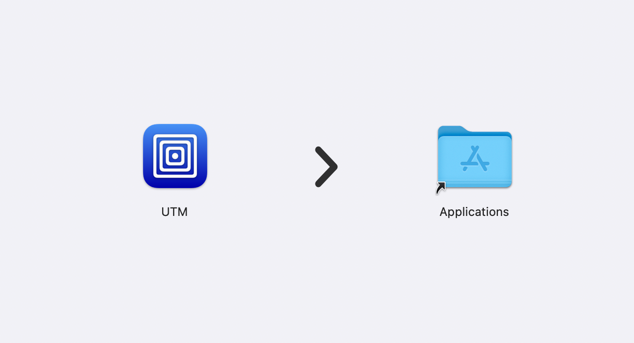
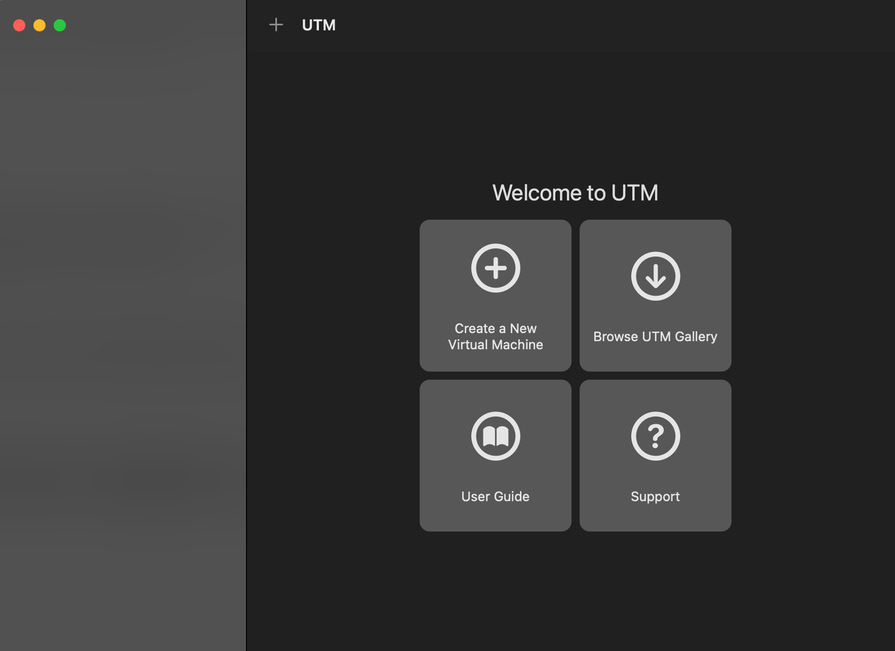
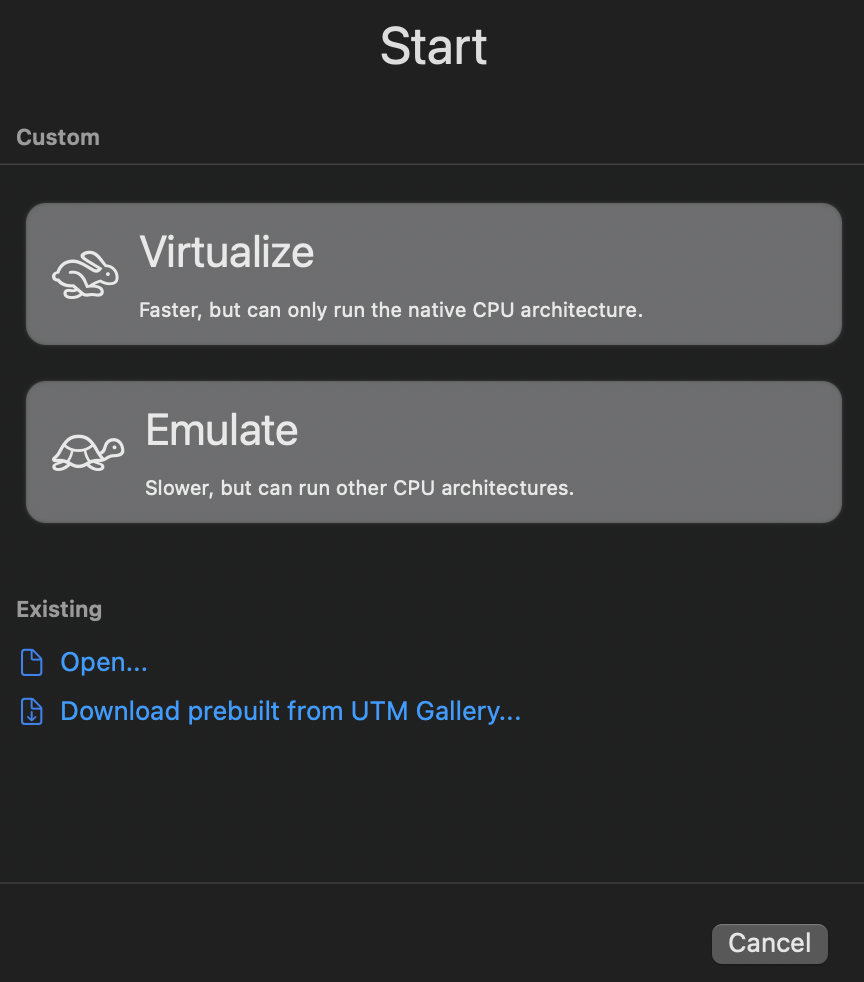
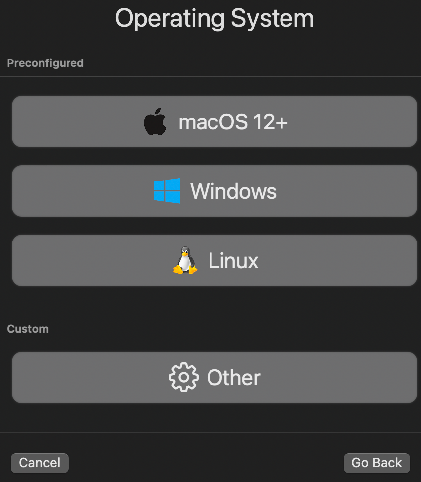
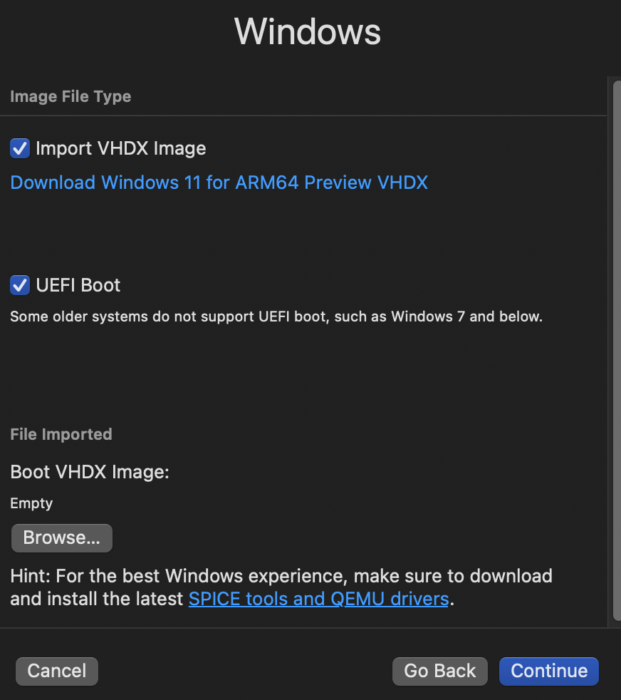
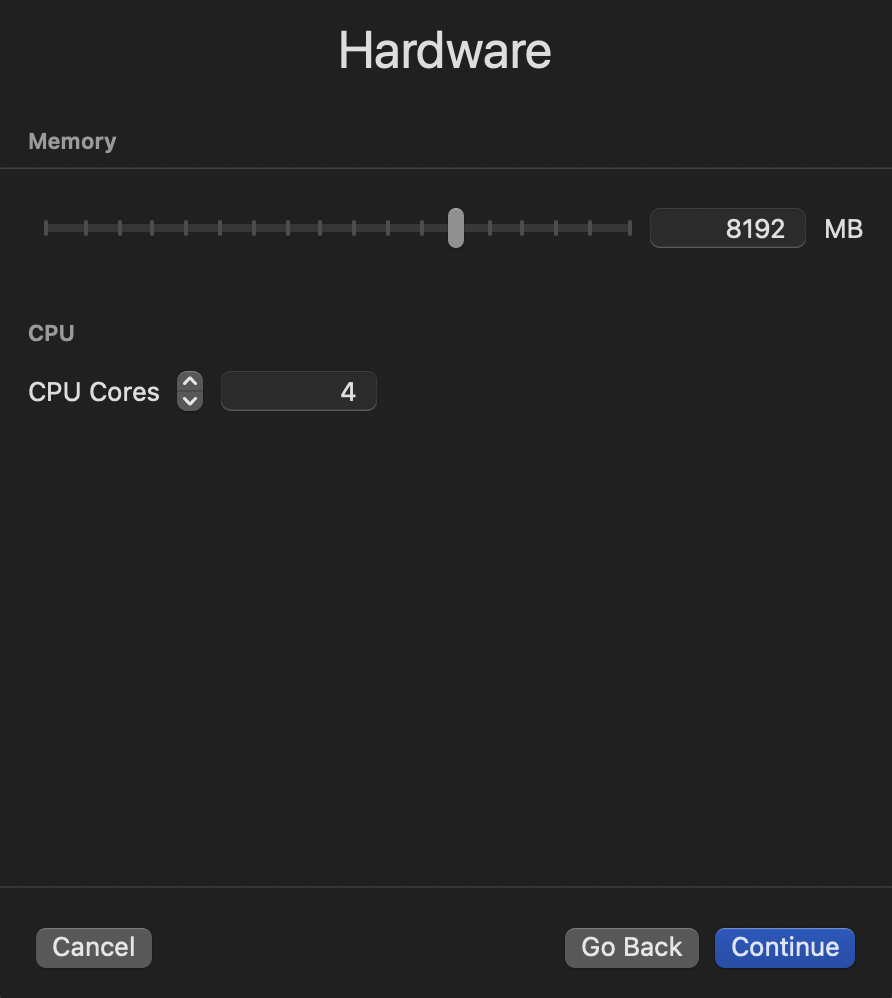

# Passo a passo para a instalação do windows 10 pro ARM no mac via VM utilizando o Software UTM.

### Acessar o link abaixo e baixar a pasta
Link para atalho <https://drive.google.com/drive/folders/1hbnCbLIlmagSGnTsY7-e-KseQXDDbcHu?usp=sharing>

## Instalação do software UTM:
1. Vá até a pasta que você baixou e execute o arquivo instalador UTM.dmg

2. Arrastar o ícone "UTM" para sua pasta de aplicações.
3. Pronto. Software instalado!  

## Setup da VM 

1. Abra o programa UTM e clique em "Create Virtual Machine".

2. Selecione "Virtualize"

3. Selecione "Windows"

3. Desmarque a opção "Import VhDX Image".
4. Clique em Browser e selecione o arquivo "imagem para instalacao windows.iso" que você baixou anteriormente. Clique em continue.

5. Coloque 8gb de memória ram e 4 CPU cores. Clique em continue.

